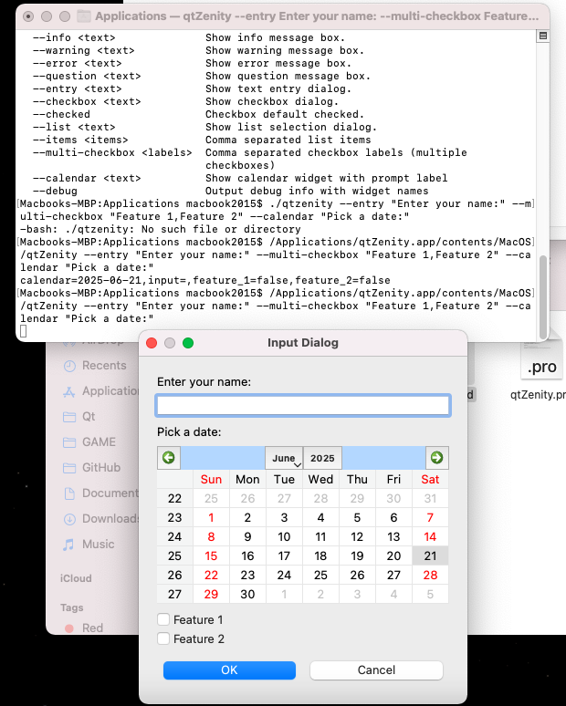

# qtZenity
zenity replacement in qt 5.12 - CLI GUI for BASH or other applications

/Applications/qtZenity.app/contents/MacOS/qtZenity -h

/Applications/qtZenity.app/contents/MacOS/qtZenity --entry "Enter your name:" --multi-checkbox "Feature 1,Feature 2" --calendar "Pick a date:"

place into /Applications folder to use it like this
/Applications/qtZenity.app/contents/MacOS/qtZenity --entry "Your name" --multi-checkbox "A,B,C" --calendar "Pick a date"   --slider "Volume,0,100,50" --dial "Speed,0,10,5" --datetime "When?"   --radio "Choose,One,Two,Three" --image /tmp/img.png,200,100   --movie /tmp/anim.gif,300,200 --clock --window-size 500,500